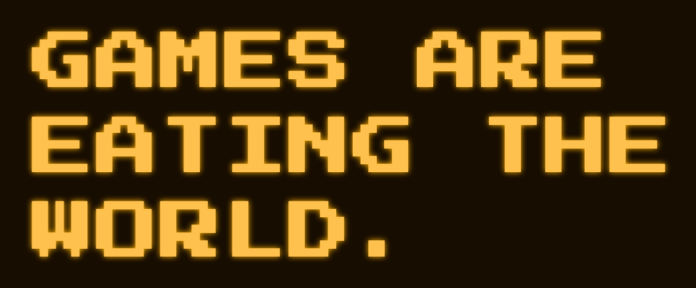

<p align="center">
  <a href="https://gamesareeatingtheworld.com">
    
  </a>
</p>

# HISCORE/1.3

The global highscore protocol, plus a video kit.
Reference registry: [gamesareeatingtheworld.com](https://gamesareeatingtheworld.com)

This repository is the spec and the client kit.

- Spec: [`hiscore.txt`](hiscore.txt)
- Schema: [`hiscore.schema.json`](hiscore.schema.json)
- Protocol client: [`gs.js`](gs.js)
- Video kit (recommended): [`hiscore.js`](hiscore.js)
- Live copies: https://gamesareeatingtheworld.com/hiscore.txt · https://gamesareeatingtheworld.com/hiscore.js

## Vibecoder-friendly: Give this line to your agent

If you are using AI agents to vibecode your games: you are welcome.

**First, this one. Protocol plus video kit** (board, tape, share card):

```
Implement HISCORE with the video kit in my game: https://gamesareeatingtheworld.com/hiscore.js
The spec is https://gamesareeatingtheworld.com/hiscore.txt
Paste: <script src="https://gamesareeatingtheworld.com/hiscore.js" data-key="YOUR_GAME_ID"></script>
Then GS.submit(score) when a run ends. HISCORE.start() when a run begins.
A score without a clip is valid. Do not require an arcade account.
```

**Optional, protocol only** (no recorder, no card):

```
Implement HISCORE protocol only, no video kit: https://gamesareeatingtheworld.com/gs.js
Spec: https://gamesareeatingtheworld.com/hiscore.txt
Paste: <script src="https://gamesareeatingtheworld.com/gs.js" data-key="YOUR_GAME_ID"></script>
Then GS.submit(score).
```

## Games are eating the world

In 2011 Marc Andreessen wrote that software is eating the world. 

That still holds. 

What happened since: software is back, and this time it arrives as a game.

The HISCORE protocol and registry solve multiple new problems:

HISCORE hunting means **pure joy for players**.

Building games is **pure joy for creators**.

## For players: get fame & find games!

Imagine this: you stumble on a new game by an unknown vibecoder in the morning and beat the highscore. 

Who will ever know that you were there?

No one.

HISCORE protocol and the global registry change that: **your highscores can finally live forever.**

**Long after the server is gone. Your score persists.**

"I was here."

"We were here."

"We are the players of the world."

"And we love highscores!"

**Players get fame. Games get players.**

## For creators: Games get players!

The other side of the coin: game builders, vibecoders, indiehackers.

We all love to create new games.

But then?

Who plays them?

Who will ever honor your creative genius and all the energy and love you put into all those little details?

No one.

HISCORE protocol and the global registry change that: 

**your games get seen and played by real players who compete for highscores in YOUR GAME.**

Now isn't that awesome?

We are turning the world into one giant, playful party for all the players out there!

For players: **discover new games, beat highscores and live in a global hall of fame forever!**

For creators: **make your game known to the world and get players who play your game!**

All you need to do is to implement the global highscore protocol.

## Change the spec

Open an issue or a pull request.

## Licence

[CC BY 4.0](LICENSE).

Contact: john@mcgrinsey.com

[Legal: Impressum](https://gamesareeatingtheworld.com/de/impressum)
